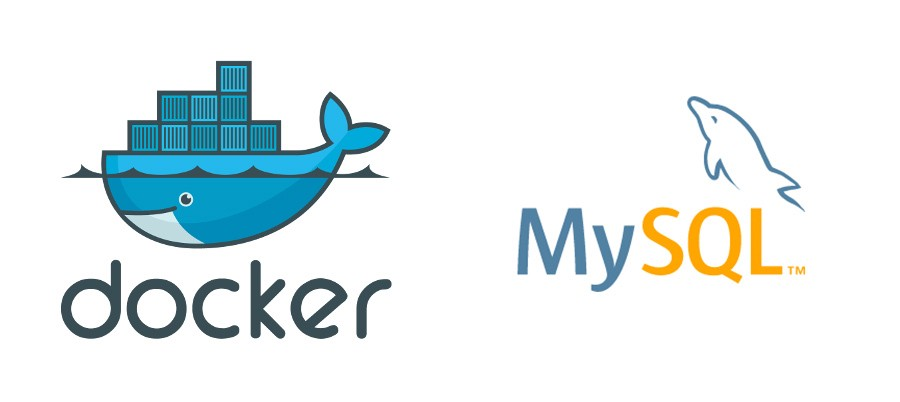

<a href="#"></a>


<!-- [](http://fvcproductions.com) -->

#  Lab Sharing Using Docker

> Worked as an equal member of a four person team to develop webapp for sharing
docker containers over the network in lab infrastructure.

> This project provides students the GUI based containers having different tools
such as rstudio, eclipse, scilab, java, etc for lab practices.

> Webapp manages user space with session management and users data is saved
using volume sharing. MySQL database is used to manage container requests and
serve them. Port forwarding is used to map containers to client browsers on
request of client.


[](https://travis-ci.org/badges/badgerbadgerbadger) [](https://gemnasium.com/badges/badgerbadgerbadger) [](https://coveralls.io/r/badges/badgerbadgerbadger) [](https://codeclimate.com/github/badges/badgerbadgerbadger) 
 [](https://rubygems.org/gems/badgerbadgerbadger) [](http://badges.mit-license.org) [](https://github.com/badges/badgerbadgerbadger)


- For more on these wonderful ~~badgers~~ badges, refer to <a href="http://badges.github.io/badgerbadgerbadger/" target="_blank">`badgerbadgerbadger`</a>.


---

## Table of Contents (Optional)


- [Installation](#installation)
- [Features](#features)
- [Contributing](#contributing)
- [Team](#team)
- [FAQ](#faq)
- [Support](#support)
- [License](#license)


---


## Installation

- Linux environment with docker,ansible installed along with apache php server.


### Clone

- Clone this repo to your local machine using `https://github.com/VARADSP/Lab-Sharing-Using-Docker/`

### Setup


> update and install this package first

```shell
$ install docker refer https://docs.docker.com/engine/install/
$ install apache php server on linux to host this web app refer https://www.digitalocean.com/community/tutorials/how-to-install-the-apache-web-server-on-centos-7
$ install mysql on linux and do the initial setup refer https://www.digitalocean.com/community/tutorials/how-to-install-mysql-on-centos-7
$ import mysql database and run the project with docker engine turned on !
```


- For all the possible languages that support syntax highlithing on GitHub (which is basically all of them), refer <a href="https://github.com/github/linguist/blob/master/lib/linguist/languages.yml" target="_blank">here</a>.

---

## Features
Students can register in webapp portal and request the containers as per their requirements in lab infrastructure to execute their practicals.


## Usage
Admin access is given to admin user who can see,delete,edit users and manage containers,server capacity.
## Documentation
Reports are included, see the Project Report to know more!
## Tests

- Used PHP for webapp backend , mysql as database , HTML,CSS,Bootstrap for template designing
- I utilized this nifty <a href="https://github.com/adam-p/markdown-here/wiki/Markdown-Cheatsheet" target="_blank">Markdown Cheatsheet</a> for this sample `README`.

---

## Contributing

> To get started...
> Fork the repo
> start contributing

### Step 1

- **Option 1**
    - 🍴 Fork this repo!

- **Option 2**
    - 👯 Clone this repo to your local machine using `https://github.com/VARADSP/Lab-Sharing-Using-Docker/`

### Step 2

- Run on Linux CentOS,Ubuntu ---- **HACK AWAY!** 🔨🔨🔨

### Step 3

- 🔃 Create a new pull request using <a href="https://github.com/VARADSP/Lab-Sharing-Using-Docker/compare/" target="_blank">`https://github.com/VARADSP/Lab-Sharing-Using-Docker/compare/`</a>.

---

## Team

>  Contributors/People

| <a href="https://github.com/VARADSP" target="_blank">**Varad Parlikar**</a> |<a href="https://github.com/VARADSP" target="_blank">`https://github.com/VARADSP`</a>|  [](https://github.com/VARADSP)    
|  


---

## FAQ

- **How do I do *specifically* so and so?**
    - No problem! Just do this.

---

## Support

Reach out to me at one of the following places!

- Website at <a href="http://debuggingbug.wordpress.com" target="_blank">`debuggingbug.wordpress.com`</a>
- Twitter at <a href="http://twitter.com/varadsp" target="_blank">`@varadsp`</a>
- Facebook at Varad Parlikar

---

## Donations (Optional)

[](https://gratipay.com/fvcproductions/)


---

## License

[](http://badges.mit-license.org)

- **[MIT license](http://opensource.org/licenses/mit-license.php)**
- Copyright 2015 © <a href="http://fvcproductions.com" target="_blank">VSPProductions</a>.
